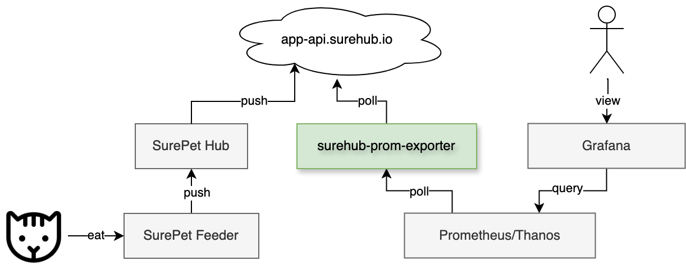

# surehub-prom-exporter

A Prometheus exporter for data from the SurePet surehub.io API documented by this [beta OpenAPI doc](https://app-api.beta.surehub.io/index.html).

I built this in order to pull data from my <https://www.surepetcare.com/en-gb/pet-feeder> to track when and how much my two cats are eating and push it into my Prometheus and Grafana stack. I wish I could have got the data out directly from the hub locally instead of bouncing it through the cloud API but the device firmwares are fairly locked down at this point. 



The container image is published to `ghcr.io/astromechza/surehub-prom-exporter`. See <https://github.com/astromechza/surehub-prom-exporter/pkgs/container/surehub-prom-exporter> for releases.

### Usage

```
Poll the surehub api on an interval and expose the data regarding device and food changes over a prometheus metrics endpoint.

You MUST configure the SUREHUB_EMAIL and SUREHUB_PASSWORD environment variables for authentication.

See more at https://github.com/astromechza/surehub-prom-exporter.

Usage:
  surehub-prom-exporter [flags]

Flags:
      --address string      the address to listen on (default ":8080")
  -h, --help                help for surehub-prom-exporter
      --interval duration   the interval to poll at (default 1m0s)
  -v, --verbose count       increase log verbosity and detail by specifying this flag one or more times
```

### Endpoints on port `8080`

- `/metrics` - the Prometheus endpoint
- `/alive` - liveness probe (is the web server running)
- `/ready` - readiness probe (did the last surehub poll succeed)

### Deployment with Score

**NOTE**: you don't have to deploy with Score! Do whatever you want with the image available.

When deployed through the Score file to Kubernetes using [`score-k8s`](https://github.com/score-spec/score-k8s) it is assumed that you have a secret named `surehub-credential` with `email` and `password` keys in it.

```
$ make clean manifests.yaml
$ kubectl use-context blah
$ kubectl create secret generic surehub-credential "--from-literal=email=....." "--from-literal=password=....." 
$ kubectl apply -f manifests.yaml
```

When deploying through `score-compose`, you should create a custom provisioner file for:

- `type=environment` with the `SUREHUB_EMAIL` and `SUREHUB_PASSWORD`
- `type=service-monitor` with no outputs

### Example Prometheus metrics

```
# HELP surehub_device_battery 
# TYPE surehub_device_battery gauge
surehub_device_battery{device_id="1234567",device_name="Feeder"} 5.19
# HELP surehub_device_last_event_at_seconds 
# TYPE surehub_device_last_event_at_seconds gauge
surehub_device_last_event_at_seconds{device_id="1234567",device_name="Feeder"} 1.71605162e+09
surehub_device_last_event_at_seconds{device_id="7654321",device_name="Hub"} 1.71605162e+09
# HELP surehub_device_online 
# TYPE surehub_device_online gauge
surehub_device_online{device_id="1234567",device_name="Feeder"} 1
surehub_device_online{device_id="7654321",device_name="Hub"} 1
# HELP surehub_weight_change 
# TYPE surehub_weight_change counter
surehub_weight_change{device_id="1234567",device_name="Feeder",event_type="EAT",pet_id="98765",pet_name="Garfield"} 11
```
